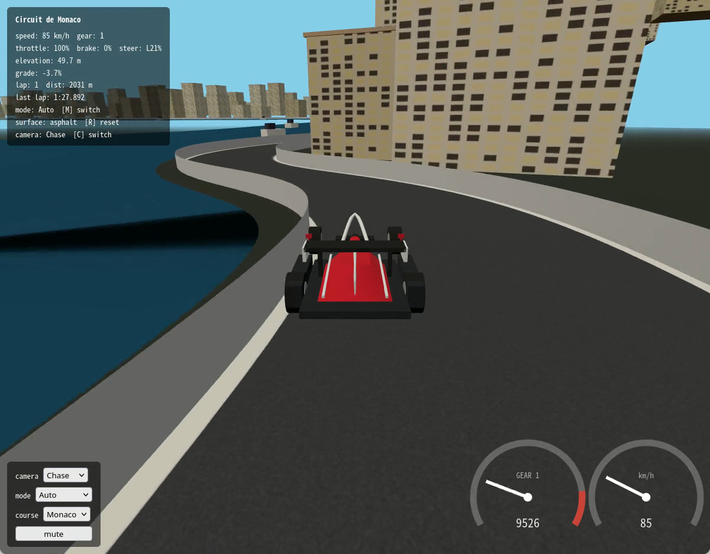
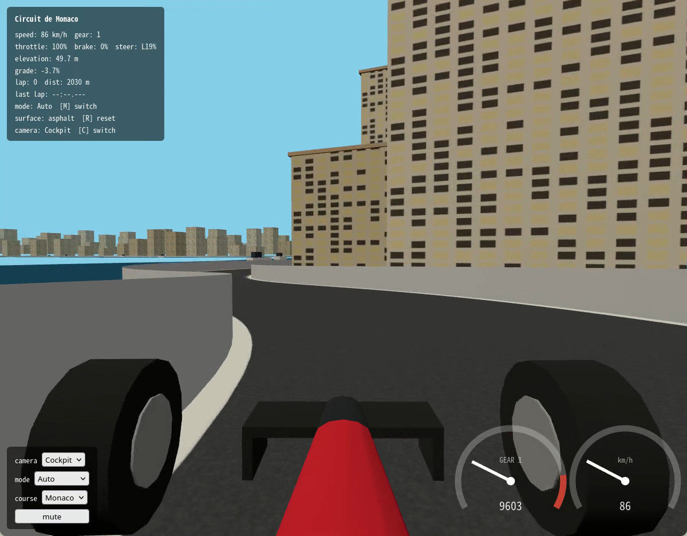
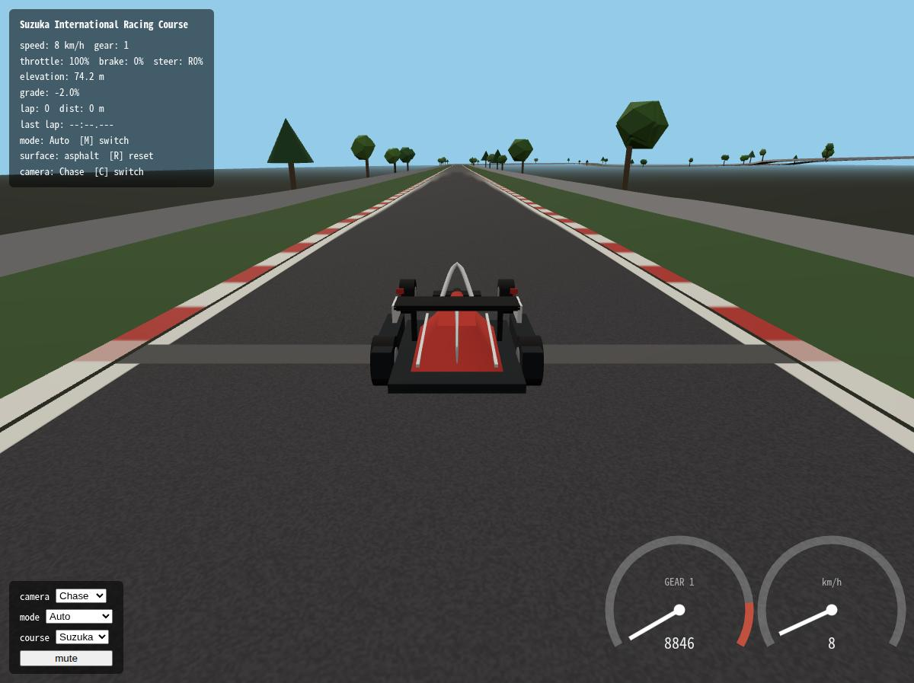
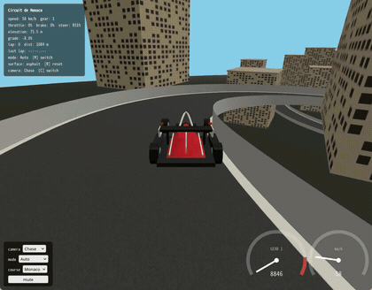
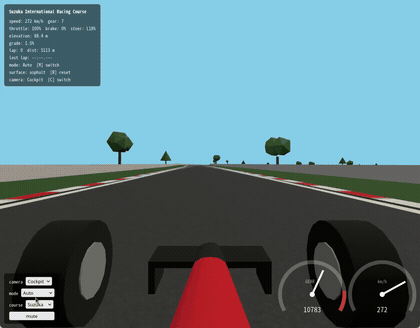

# Gradient Circuit

A minimal driving simulator that reproduces real F1 circuits (Monaco GP, Suzuka) — including elevation — and lets you drive laps around them in your browser.

**[Play now](https://patakuti.github.io/gradient-circuit/)** — no install needed. On Android, you can also download the APK from the [Releases page](https://github.com/patakuti/gradient-circuit/releases) instead of building it yourself.

> **Disclaimer**: Gradient Circuit is an unofficial, fan-made project and is not affiliated with, endorsed by, or associated in any way with Formula 1, FIA, or Formula One Licensing B.V. F1, FORMULA 1, FIA FORMULA ONE WORLD CHAMPIONSHIP, and related marks are trademarks of Formula One Licensing B.V. Course and reference-speed data are derived from public FIA/Formula 1 timing data via [FastF1](https://github.com/theOehrly/Fast-F1) and are used here only as a summarized/derived pacing reference for gameplay — not to identify or represent any individual driver.

## Overview

- Generates circuit course data (centerline, track width, elevation, curvature) from FastF1 telemetry. Monaco and Suzuka are supported.
- Runs a lap-driving simulation in the browser (Three.js) with throttle, brake, and steering. A single dropdown switches between centerline auto-follow, assisted manual steering (Assist, with 25/50/75% assist strength), and fully manual steering. Behavior when you go off-track (curb, grass, barrier) is modeled per surface type.
- Also works on Android (Chrome, or as an installable APK wrapped with Capacitor). Steer by tilting the device; use touch pedals or front/back tilt for throttle/brake.
- Course data generation (Python) and the simulator (TypeScript/Three.js) are connected through a loosely-coupled intermediate format (JSON), designed to allow porting to a different engine later.

## Screenshots

| Monaco (chase camera) | Monaco (cockpit camera) | Suzuka (chase camera) |
|---|---|---|
|  |  |  |

| Monaco — hairpin | Suzuka — chicane |
|---|---|
|  |  |

## Layout

```
gradient-circuit/
├── tools/   # Course data generation (Python + FastF1)
└── web/     # The driving simulator (Vite + TypeScript + Three.js)
```

## Setup

### Course data generation (`tools/`)

```bash
cd tools
uv sync
```

Requires Python 3.12+ and [uv](https://docs.astral.sh/uv/).

### Simulator (`web/`)

```bash
cd web
npm install
npm run dev
```

Requires Node.js 18+. After `npm run dev`, open the printed URL (default `http://localhost:5173/`) in your browser.

## How to play

Use the arrow keys / WASD: `↑`/`W` for throttle, `↓`/`S` for brake, `←`/`A` to steer left, `→`/`D` to steer right. Steering ramps up smoothly while held and self-centers back to neutral when released. If you enter a corner too fast for its curvature, the car doesn't auto-brake — it pushes wide (understeer) instead, so brake early enough to hold your line.

Cycle the drive mode with the `M` key, or the "mode" dropdown at the bottom left (Manual → Assist 25% → Assist 50% → Assist 75% → Auto, looping back to Manual).

| Mode | Behavior |
|---|---|
| Auto (default) | Driving assistance handles steering and braking automatically — throttle alone is enough to complete laps. The target speed is the lesser of the real reference lap's pace and the grip limit (see below) |
| Assist 25% / 50% / 75% | You control steering and braking yourself, with assistance blended in at the chosen strength (steering nudged back toward the line, braking topped up where you're short) |
| Manual | You control steering and braking entirely yourself |

Going off-track changes behavior depending on the surface. Monaco (a street circuit) has a barrier immediately outside the track. Suzuka (a purpose-built circuit) has curb (0.6 m, slightly reduced grip) → grass (6 m, grip and acceleration drop sharply) → barrier, so running onto the grass noticeably slows you down while you can still steer back onto the track. Neither course lets you cross the barrier, but you can keep driving alongside it. Press `R` to reset onto the track (nearest centerline point, speed 0) — lap count and distance are preserved. The current surface type is shown in the HUD.

Press `C` to switch between the chase camera (following from behind) and the cockpit camera (driver's-eye view). A procedurally generated car model (no external 3D assets) is shown in both views: a tapered nose, a halo above the cockpit, and a two-tone livery (not modeled after any real team). The front wheels turn visually with your steering input, and all four wheels appear to rotate based on your speed. Completing a lap logs to the browser's developer console.

Engine, braking, and tire-scrub sounds (heard while pushing wide beyond the grip limit) play alongside curb/grass/barrier contact sounds — all procedurally generated with the Web Audio API, no external audio files. Due to browser autoplay restrictions, sound activates on your first key press. Mute it with the "mute" button at the bottom left.

Gear (1st–8th) and engine RPM are derived automatically from your speed (there's no manual shifting). The gear/speed mapping and the shift-up/down thresholds were measured from real telemetry (FastF1's `nGear`/`RPM` channels). Engine pitch tracks RPM and dips at the instant of each upshift. A tachometer and speedometer are shown at the bottom right (the current gear also appears in the text HUD).

Cornering grip limits vary with speed (`min(a0 + k*v^2, a_cap)`). The coefficients weren't eyeballed — they come from a least-squares fit against real telemetry (all clean laps).

In Auto mode, the target speed is the lesser of the course's fastest clean lap's real speed profile and the grip-limit speed above — the goal is to trace an actual driver's pace, based on reference speed data bundled in `course/*.json` rather than guesswork. Which driver/lap was used is shown in the `?debug=1` debug overlay (reference/target).

Procedurally generated scenery (no external 3D assets) surrounds the track, styled to match each course's character: Monaco has buildings, a tunnel section, and a harbor section (water and yachts); Suzuka has curbs, grass, and trees. Monaco's buildings use a palette of pale tones (cream, ochre, terracotta, soft pink, etc.) evoking a Mediterranean streetscape, and Suzuka's trees mix broadleaf-style (rounded canopies) and conifer-style (cones).

`npm run build` outputs a production build to `web/dist/`. `npm run lint` runs ESLint (it will flag any `import` of `three` from under `sim/`).

### Android (`web/android/`)

Opening the app in a browser on a touch-primary device (e.g. a smartphone) switches from the keyboard UI to a touch-oriented layout, locked to landscape orientation.

- **Steering**: tilt the device left/right
- **Throttle/brake**: touch pedals at the bottom left (brake) and bottom right (throttle), or select "Tilt" in the settings panel's "throttle/brake" dropdown to use front/back tilt instead (tilt forward = throttle, tilt back = brake)
- **Settings panel**: opened/closed with the "☰" button at the top right (driving pauses while it's open). It bundles drive mode switching (Manual/Assist 25/50/75%/Auto), tilt calibration, a reset button (equivalent to the `R` key), camera/course selection, and mute
- **HUD**: the top-left display is reduced to just speed / lap / mode. More detail (throttle/brake/steer %, elevation, surface type, etc.) is available in the settings panel or the `?debug=1` debug overlay

> The left/right and front/back tilt mapping (which way you tilt vs. which way it responds) has been verified on a real device (`ROLL_SIGN=-1`/`PITCH_SIGN=+1`). If it feels reversed on a different device, flip these constants in `web/src/sim/tiltInput.ts`.

A prebuilt APK is available from the **[Releases page](https://github.com/patakuti/gradient-circuit/releases)** — download and install it directly rather than building your own. The steps below are only needed if you want to build it yourself.

To package it as an installable app (APK), [Capacitor](https://capacitorjs.com/) wraps the existing web build. This requires the Android SDK (build-tools, platform-tools) and `ANDROID_HOME` to be set up.

```bash
cd web
npm run build
npx cap sync android
cd android
./gradlew assembleDebug
adb install -r app/build/outputs/apk/debug/app-debug.apk
```

`web/android/` is the native project generated by Capacitor. Build output, signing keys (`*.keystore`/`*.jks`), and `local.properties` are not tracked in git. Only debug builds are supported; store-signed release builds are out of scope.

## Distribution

There's no Play Store release — distribution relies only on standard GitHub features (Actions/Pages/Releases).

- **Desktop/browser**: pushing to `main` triggers GitHub Actions (`.github/workflows/pages.yml`), which builds and deploys automatically to **[GitHub Pages](https://patakuti.github.io/gradient-circuit/)**. Publishing requires a one-time repository setting: **Settings → Pages → Source → "GitHub Actions"**. Note that GitHub Pages for a *private* repository needs a paid plan (GitHub Pro/Team/Enterprise) — on the Free plan, the repository needs to be public for Pages to serve it.
- **Android (APK)**: pushing a tag matching `v*` triggers GitHub Actions (`.github/workflows/android-apk.yml`), which builds an unsigned debug APK and attaches it to that tag's **[GitHub Release](https://github.com/patakuti/gradient-circuit/releases)**. Since it isn't distributed through a store, installing it requires allowing "install from unknown sources" on the device.

### Switching courses

Use the "course" dropdown at the bottom left, or append `?course=<id>` to the URL (default `monaco`).

| Course | `id` |
|---|---|
| Monaco | `monaco` |
| Suzuka | `suzuka` |

Example: `http://localhost:5173/?course=suzuka`

## Regenerating course data

The bundled `web/public/course/monaco.json` / `web/public/course/suzuka.json` were generated from each race's FastF1 data. To regenerate them:

```bash
cd tools
uv run gradient-circuit generate --circuit monaco --out ../web/public/course/monaco.json
uv run gradient-circuit generate --circuit suzuka --sg-window-narrow 9 --out ../web/public/course/suzuka.json
```

- `--circuit` (default `monaco`) selects the course. Per-course settings (the FastF1 event name, acceptance-criteria targets, track-width clamp range) live in `tools/src/gradient_circuit/circuits.py`.
- Suzuka requires `--sg-window-narrow 9` (works around the chicanes being smoothed into too-wide a curve; don't apply it to Monaco — it breaks the closure seam near the reference line's own start/end).
- The session is auto-selected by default (the most recent race with available position data, searching backward from the current year). You can specify one explicitly, e.g. `--year 2026`.
- The first run takes a few minutes since FastF1 fetches data from its API. Fetched data is cached under `tools/.fastf1cache/` (not tracked in git).
- After generation, the course data is automatically checked against acceptance criteria (total length, elevation range, overall width, loop-closure error, curvature continuity, no missing values, consistent sample-array lengths, reference-speed reachability), and the results are printed to the console. Target values differ per course (Monaco: length 3337 m ±3%, elevation range 40 m ±15%, width 8–12 m; Suzuka: length 5807 m ±3%, elevation range 40 m ±15%, width 10–16 m) — see `circuits.py` for specifics.
- During generation, the fastest clean lap's speed from real telemetry for that session is extracted and stored as a `reference` block in `course/<id>.json` (used for the Auto mode target speed above). If too many segments are unreachable given the grip limit (more than 20% by default), it automatically falls back to a slower clean lap.

### Tests

```bash
cd tools
uv run pytest
```

These are unit tests for geometry calculations (curvature sign, arc-length resampling, track-width clamping, acceptance-criteria checks, grip-model fitting, reference speed profiles, gear/RPM fitting) that don't require network access to FastF1.

## Real-telemetry fit for the vehicle grip model

The cornering grip limit used by the simulator's vehicle model (`web/src/sim/vehicleParams.ts`) isn't a hand-picked constant — it's fit from real telemetry. It's speed-dependent (`a = min(a0 + k * v^2, a_cap)`, representing increasing downforce with a tire-load-sensitivity cap), and measured via a separate subcommand from course data generation.

```bash
cd tools
uv run gradient-circuit fit-grip
```

- Projects every clean lap's real speed onto the target course's `course/<id>.json` (must already be generated), then fits a least-squares curve to the p95 envelope per speed bin.
- Targets every course in `circuits.py` by default; narrow it with `--circuit`.
- The resulting `mechLateralAccel` / `aeroLateralCoeff` / `maxLateralAccelCap` values are applied to `web/src/sim/vehicleParams.ts`.

## Real-telemetry fit for gear/RPM

The simulator's gear and engine RPM (display/sound only, `DEFAULT_SHIFT_PARAMS` in `web/src/sim/vehicleParams.ts`) are likewise fit from real telemetry (FastF1's `nGear`/`RPM` channels) rather than guessed. As with the grip model, this is measured via a separate subcommand from course data generation.

```bash
cd tools
uv run gradient-circuit fit-shift
```

- Pools `nGear`/`RPM`/`Speed` across every clean lap, fits a linear RPM-vs-speed relationship per gear, and computes shift-up/down speeds per gear boundary (the measured median). Course position isn't a factor here, since gear/RPM are vehicle characteristics independent of course position `s`.
- Targets every course in `circuits.py` by default; narrow it with `--circuit`.
- The resulting `gearCount` / `idleRpm` / `redlineRpm` / `shiftUpSpeeds` / `shiftDownSpeeds` / `gearRpmCoeffs` values are applied to `web/src/sim/vehicleParams.ts`.

## Porting to another engine

`web/public/course/*.json` (both Monaco and Suzuka) is an engine-agnostic intermediate format (`gradient-circuit/course@2`) that contains nothing Three.js-specific. Coordinates are right-handed with Z up (conversion to Three.js's Y-up is handled by `web/src/course/loader.ts`). Any engine — Unity, for example — can load this JSON directly and use the same course data.

| Needs reimplementing | Reusable as-is |
|---|---|
| `web/src/render/*` (Three.js-specific rendering) | `web/public/course/*.json` (the data itself) |
| `web/src/ui/*` (DOM-specific HUD/controls) | The algorithms in `web/src/sim/track.ts` / `sim/vehicle.ts` (pure math, no `three` dependency — enforced mechanically by ESLint) |
| `web/src/camera/*Rig` (camera-API-specific) | The interface definitions in `web/src/camera/types.ts` |

## About this project

This tool was designed and implemented entirely by Claude. The human provided the idea. However, this isn't a one-shot output; the human shaped it through hands-on testing and iterative, detail-oriented feedback.

## License

[MIT](LICENSE)
